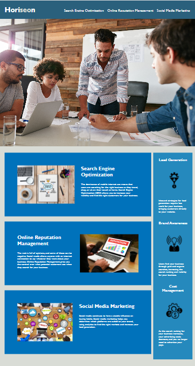

# Module 1 Challenge

## Description

The following challenge involves taking starter code for a basic HTML website and refactoring it. 

- HTML Semantic elements were applied
- CSS was consolidated
- Responsive elements were added

Could has been updated without changing the core format or function.

## Installation

Page is live on GitHub pages: https://mdwag316.github.io/Module-1-Challenge/

## Image

## Usage

N/A

## Credits

N/A
